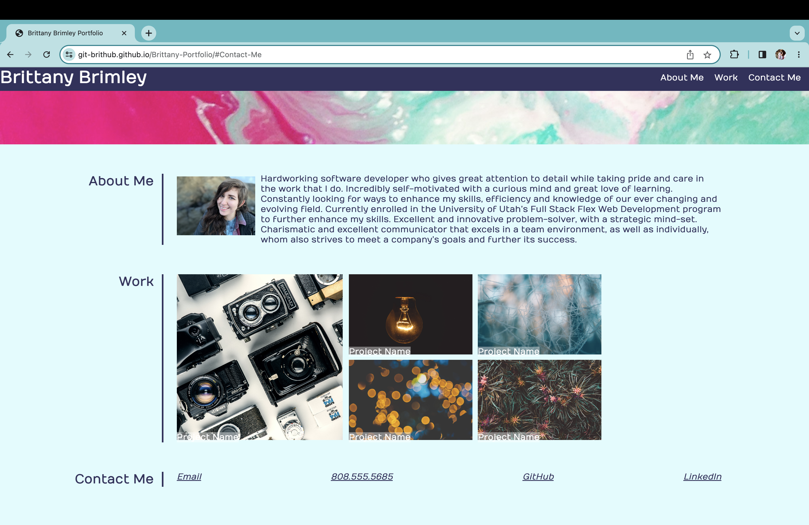

# Brittany-Portfolio
## Links
[GitHub Repo](https://github.com/Git-BritHub/Brittany-Portfolio.git)
 
[Live URL](https://git-brithub.github.io/Brittany-Portfolio/)
## Description
For this CSS-focused project, I built and designed my own webpage to provide potential employers a portfolio of my work.
## Usage

## Credits
Sought guidance and feedback from the U of U's software developer tutors and AskBCS agents.
 
All HD background images for this project were obtained from pexels.com.
 
Headshot of myself was taken and provided by Amanda Cooper.